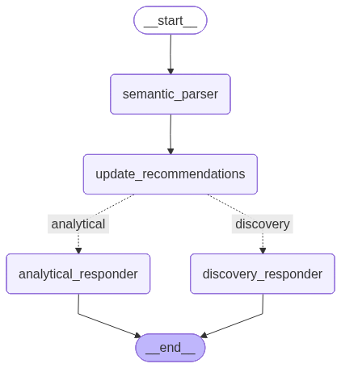

# IDSS

A conversational product decision support assistant built with LangGraph that helps users find and evaluate vehicles through natural dialogue.

## Architecture Overview
 

The agent uses a multi-node LangGraph workflow with two operating modes:
- **Discovery Mode** (simple mode, simple LLM node): Helps users explore and refine their vehicle search, asking questions to get user's implicit preferences.
- **Analytical Mode** (complex mode, ReAct agent with SQL database, api tools, etc.): Answers specific questions about vehicles using tools. E.g. compare two vehicles, list features of a vehicle, etc.

The workflow intelligently skips recommendation updates when filters haven't changed, reducing API calls and improving response time.

## State Variables

```python
VehicleSearchState = {
    "explicit_filters": VehicleFilters,           # Extracted search criteria
    "conversation_history": List[BaseMessage],    # Full chat history
    "implicit_preferences": ImplicitPreferences,  # Inferred preferences
    "recommended_vehicles": List[Dict],           # Top 20 matches
    "questions_asked": List[str],                 # Topics already discussed
    "previous_filters": VehicleFilters,           # Previous filters for change detection
    "ai_response": str                            # Latest response
}
```

**VehicleFilters** (extracted from user input):
- Basic: make, model, year, body_style, transmission, fuel_type, drivetrain
- Pricing: price_min, price_max, miles_max
- Appearance: exterior_color, interior_color
- Physical: seating_capacity, doors
- Location: state, zip, distance

**ImplicitPreferences** (inferred):
- priorities, lifestyle, budget_sensitivity, concerns, brand_affinity

## Node Descriptions

### 1. Semantic Parser
- extract structured data from user's natural language input
- Merges new filters with existing state
- Updates implicit preferences throughout conversation

### 2. Should Update Recommendations (Router)
- Checks if filters changed or if this is the first search
- Routes to "update" or "skip" to avoid unnecessary API calls

### 3. Update Recommendations
- ReAct agent with API tools and SQL database
- Updates the recommended list only when filters change or no vehicles exist yet
- Stores current filters as previous_filters for next comparison

### 4. Mode Router
- **Discovery**: When user update filters and preferences, or ask simple questions, the discovery agent will describe the current recommendation list and ask follow-up questions to extract more user preferences.
- **Analytical**: When user ask more complex questions that needs tool use / query database. E.g. compare the pros and cons of two vehicles.

### 5. Discovery Responder
- Displays top 10 vehicles with details
- Summarizes listings with recommendations
- Asks 2-3 elicitation questions
- Tracks questions to avoid repetition

### 6. Analytical Responder
- ReAct agent with multiple tools:
  - `get_vehicle_listing`: Detailed listing of vehicles given filters.
  - `get_vehicle_listing_by_vin`: Detailed listing by VIN
  - `get_vehicle_photos_by_vin`: Photos by VIN
  - SQL tools: `sql_db_query`, `sql_db_schema`, `sql_db_list_tables`
- Can query safety_data (NHTSA ratings) and feature_data (EPA fuel economy) databases

## Tools & Data Sources

### Auto.dev API
- `search_vehicle_listings`: Search millions of active vehicle listings
- `get_vehicle_listing_by_vin`: Get detailed info for specific VIN
- `get_vehicle_photos_by_vin`: Get photos for specific VIN

### SQL Databases
- **safety_data.db**: NHTSA crash tests, safety ratings, features (query by make, model, model_yr)
- **feature_data.db**: EPA MPG ratings, fuel economy, emissions, engine specs (query by Make, Model, Year)

Both databases combined using SQLite ATTACH for unified querying.

## Installation

### 1. Create Conda Environment

```bash
conda create -n idss python=3.10
conda activate idss
```

### 2. Install Dependencies

```bash
pip install -r requirements.txt
```

### 3. Set Environment Variables

Create a `.env` file in the project root:
```bash
OPENAI_API_KEY=your_openai_key_here
AUTODEV_API_KEY=your_autodev_key_here
```

## Usage

### Interactive CLI Demo

```bash
python scripts/demo.py
```

Commands: `state` (view filters), `reset`, `quit`/`exit`

### API Server

Start the server:
```bash
python api/server.py
```

Stop the server:
```bash
# Press Ctrl+C for graceful shutdown
```

API Documentation: http://localhost:8000/docs

### API Endpoints

- `GET /` - Health check
- `POST /chat` - Main conversation endpoint
  - Request: `{"message": "I want a Jeep", "session_id": "optional"}`
  - Response: `{"response": "...", "vehicles": [...], "filters": {...}, "preferences": {...}, "session_id": "..."}`
- `GET /session/{session_id}` - Get session state
- `POST /session/reset` - Reset session
- `DELETE /session/{session_id}` - Delete session
- `GET /sessions` - List all active sessions (debug)
